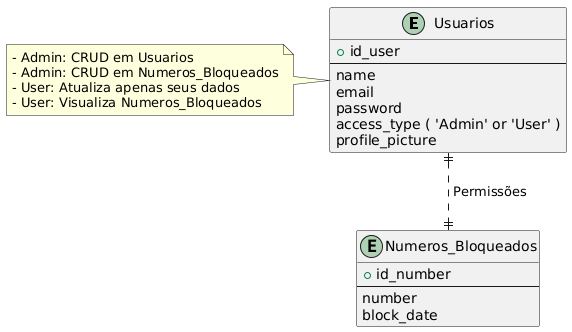

# Banco de Dados

## Diagrama ER

## Dicionário de Dados

### Tabela: **Usuarios**

| Campo           | Tipo                  | Descrição                       | Restrições                  |
| --------------- | --------------------- | ------------------------------- | --------------------------- |
| id_user         | INT                   | Identificador único do usuário. | PRIMARY KEY, AUTO_INCREMENT |
| name            | VARCHAR(100)          | Nome do usuário.                | UNIQUE                      |
| email           | VARCHAR(100)          | Email do usuário.               | UNIQUE, NOT NULL            |
| password        | VARCHAR(255)          | Senha do usuário.               | NOT NULL                    |
| access_type     | ENUM('admin', 'user') | Tipo de acesso                  | NOT NULL, DEFAULT 'user'    |
| profile_picture | BLOB                  | Foto de perfil do usuário.      | NULL                        |

---

### Tabela: **Numeros_Bloqueados**

| Campo      | Tipo        | Descrição                                  | Restrições                  |
| ---------- | ----------- | ------------------------------------------ | --------------------------- |
| id_number  | INT         | Identificador único do número bloqueado.   | PRIMARY KEY, AUTO_INCREMENT |
| number     | VARCHAR(15) | Número de telefone bloqueado.              | UNIQUE, NOT NULL            |
| block_date | TIMESTAMP   | Data e hora em que o número foi bloqueado. | DEFAULT CURRENT_TIMESTAMP   |

